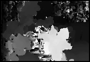
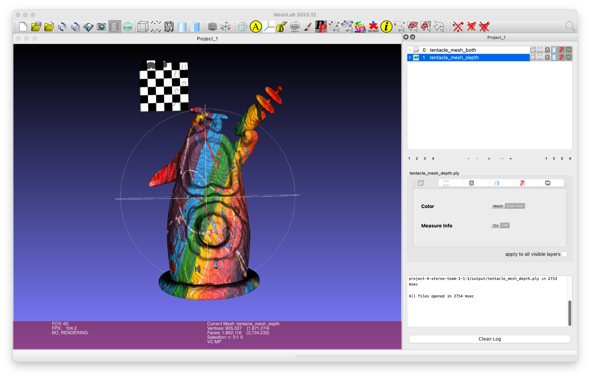
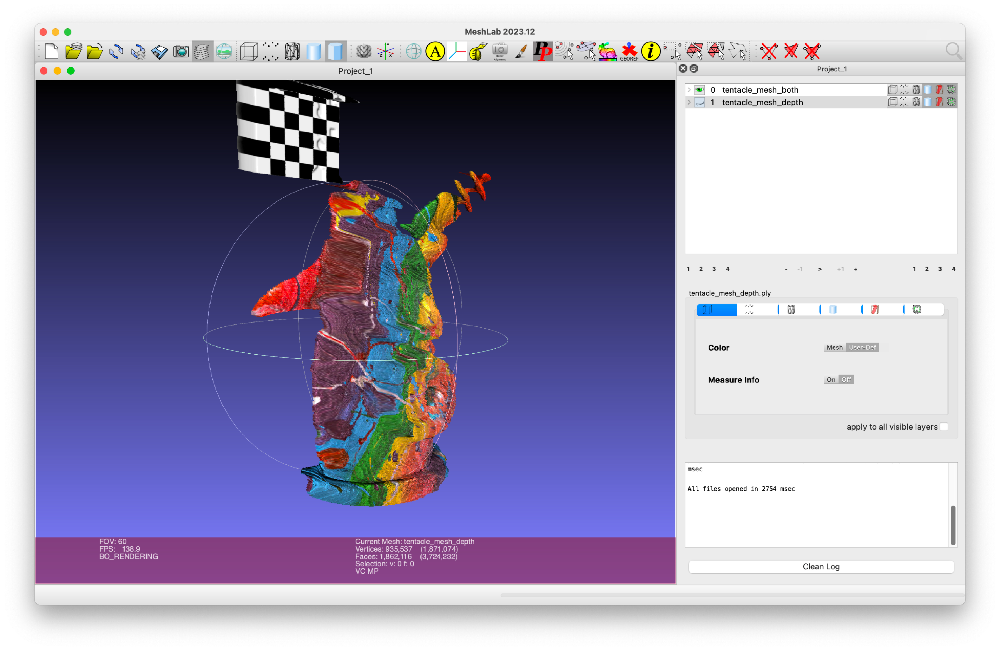
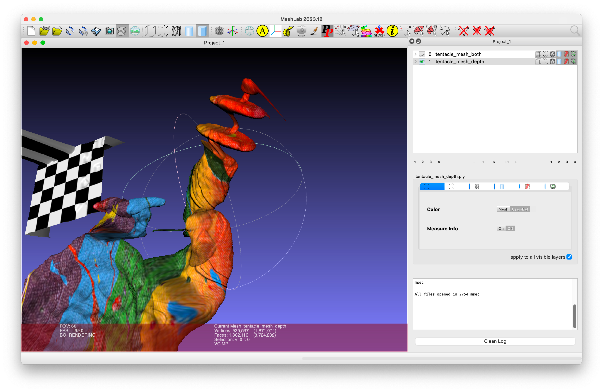
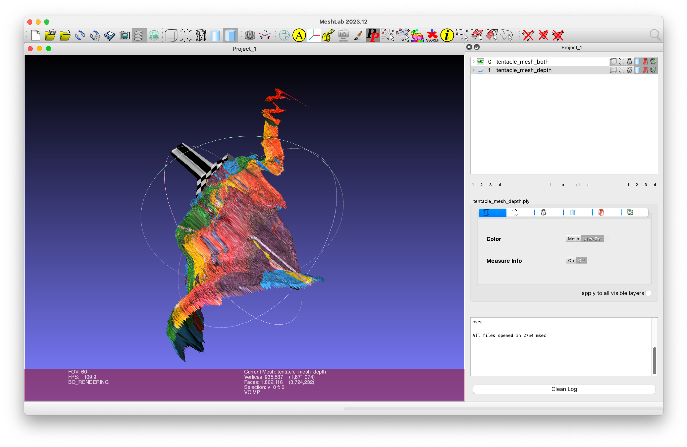
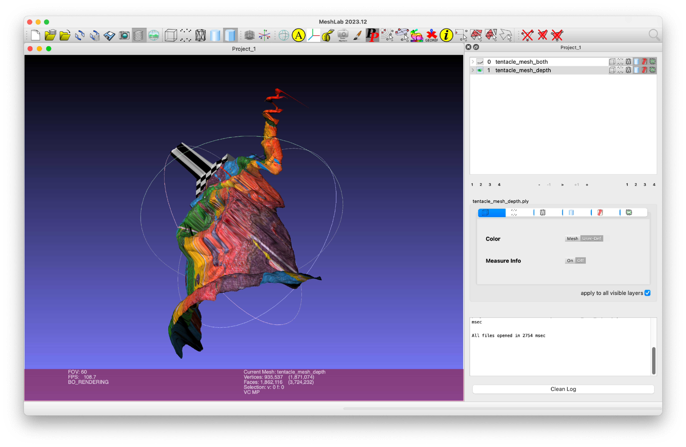

# CS5670 Computer Vision

## Project 4: Stereo Vision

### Introduction

Implementing a stereo vision system to reconstruct 3D scenes from pairs of stereo images.

* Compute disparity maps using block matching
* Implement simple triangulation to recover depth
* Create point clouds and depth maps
* Handle occlusions and improve matching accuracy

Detailed project description can be found [here](http://www.cs.cornell.edu/courses/cs5670/2024sp/projects/pa4/index.html).

### Steps

1. Rectify stereo image pairs (if necessary)
2. Compute disparity maps using block matching
3. Implement triangulation to recover depth information
4. Create point clouds and depth maps from disparity
5. Handle occlusions and improve matching accuracy
6. Visualize results and evaluate performance

### Structure

| Name         | Function                                        |
| ------------ | ----------------------------------------------- |
| /resources   | Stereo image pairs for testing                  |
| stereo.py    | Main implementation of stereo algorithms        |
| utils.py     | Utility functions for image processing          |
| visualize.py | Functions for visualizing results               |
| evaluate.py  | Evaluation metrics for disparity maps           |
| gui.py       | GUI for interacting with the stereo system      |

#### Libraries used

* matplotlib=3.8.0
* numpy=1.21.5
* opencv=4.6.0
* pillow=10.0.1
* py-opencv=4.6.0
* pyparsing=3.0.9
* python=3.9
* pyttk=0.3.2
* scipy=1.7.3
* tk=8.6.12

### Results

| tentacle albedo  | tentacle ncc  | tentacle normals  |
| --------------------------------------------------------- | --------------------------------------------------------- |--------------------------------------------------------- |
|   |   |   | 

   

| cat albedo  | cat normals  |
| --------------------------------------------------------- | --------------------------------------------------------- |
|   |   |

  

| flowers ncc  |
| --------------------------------------------------------- | 
|   |

### 1. Tentacle Dataset: Comparison between "Both-mode" and "Depth-mode"
- **Both-mode** (combining photometric stereo and plane sweep stereo) and depth-mode (plane sweep stereo only) struggle with accurately reconstructing the checkerboard pattern on the tentacle, causing a weird extrusion.
- **Depth-mode** performs better at capturing smoother details, such as border lines and the clarity of the gun, indicating it handles depth discontinuities and fine details more effectively.
- Main issue:
  - Differing albedos of the black and white squares.
  - Changing albedo of the tentacle confuses both photometric stereo and plane sweep stereo.
  - Likely due to poor lighting and reflections, leading to inaccurate computations.

| Both  | Depth  |
| --------------------------------------------------------- | --------------------------------------------------------- |
|   |   |
|   |   |
|   |   |
|   |   |

### 2. Cat Dataset: Mode Set to Normals
- The photometric stereo of the cat is successful without major mistakes.
- Minor distortion is observed in the right eye from a specific angle, but no significant issues are seen from other angles.
- The uniform color of the cat makes the computation of albedo and surface normals easier.

|  |   |
| --------------------------------------------------------- | --------------------------------------------------------- |
|   |   |
|   |   |

### 3. Flower Dataset: Mode Set to Depth
- The dataset shows depth errors (mountain-like appearance) and only correctly identifies the flowers and sofa in the lower part of the image.
- Likely causes:
  - Interreflections and subsurface scattering inside the house.
  - High color diversity, making it difficult for the depth and NCC algorithms to capture the correct depth.
- The captured flowers are not accurate, as the borders include background pixels, affecting the results.

|  |   |
| --------------------------------------------------------- | --------------------------------------------------------- |
|   |   |
|   |   |
