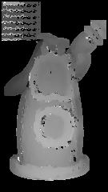
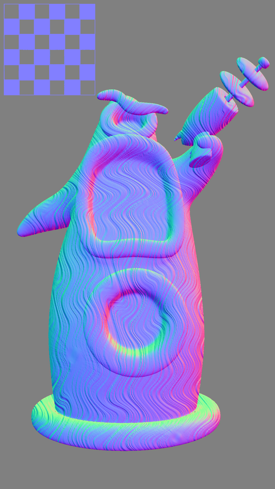
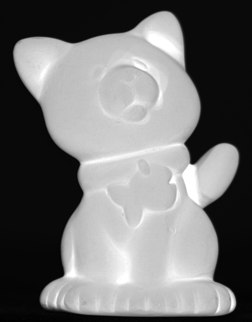
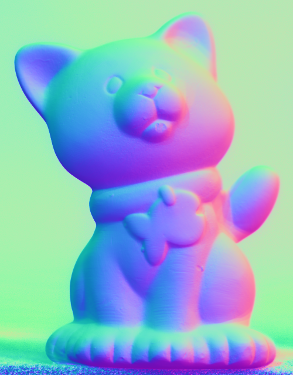

# CS5670 Computer Vision

## Project 4: Stereo Vision

### Introduction

Implementing a stereo vision system to reconstruct 3D scenes from pairs of stereo images.

* Compute disparity maps using block matching
* Implement simple triangulation to recover depth
* Create point clouds and depth maps
* Handle occlusions and improve matching accuracy

Detailed project description can be found [here](http://www.cs.cornell.edu/courses/cs5670/2024sp/projects/pa4/index.html).

### Steps

1. Rectify stereo image pairs (if necessary)
2. Compute disparity maps using block matching
3. Implement triangulation to recover depth information
4. Create point clouds and depth maps from disparity
5. Handle occlusions and improve matching accuracy
6. Visualize results and evaluate performance

### Structure

| Name         | Function                                        |
| ------------ | ----------------------------------------------- |
| /resources   | Stereo image pairs for testing                  |
| stereo.py    | Main implementation of stereo algorithms        |
| utils.py     | Utility functions for image processing          |
| visualize.py | Functions for visualizing results               |
| evaluate.py  | Evaluation metrics for disparity maps           |
| gui.py       | GUI for interacting with the stereo system      |

#### Libraries used

* matplotlib=3.8.0
* numpy=1.21.5
* opencv=4.6.0
* pillow=10.0.1
* py-opencv=4.6.0
* pyparsing=3.0.9
* python=3.9
* pyttk=0.3.2
* scipy=1.7.3
* tk=8.6.12

### Results

### For Part 1 and 2

| tentacle albedo  | tentacle ncc  | tentacle normals  |
| --------------------------------------------------------- | --------------------------------------------------------- |--------------------------------------------------------- |
|   |   |   | 

   

| cat albedo  | cat normals  |
| --------------------------------------------------------- | --------------------------------------------------------- |
|   |   |

  

| flowers ncc  |
| --------------------------------------------------------- | 
|   |

### Part 3
